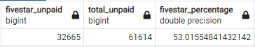

# Amazon_Vine_Analysis

## Overview
Amazon Vine is a program that allows publishers and manufacturers to provide their product to a set of members that provide reviews for a small fee. It felt best to chose the sports data set for this assignment, considering I am an embarrassingly avid sports fan. We are going to gather the data from amazon and store it in a cloud data base instance with SQL. Once we have the data, we will run an analysis to determine if there is a bias coming from reviews that come from Vine members.  

## Results
-	There were 334 Vine reviews, and 61 614 non-Vine reviews
-	There were 139 five star Vine reviews, and 32 665 non-Vine reviews
-	42% of Vine reviews were five stars, and 53% of non-Vine reviews were five stars 

  

## Summary
It seems there is a bias towards non-Vine reviews. There is a clear difference of 11% when it comes to the percentage of five star reviews. With this in mind, it is best for producers and publishers not to pay for Vine reviews, regardless of however small the fee may be. An argument could be made that the Vine reviews provide a more insightful customer feedback. If it is the case that we are looking to gather customer feedback – we should conduct our own independent of the platform we are selling on. Five star reviews on the Amazon platform are important since they could influence a potential sale. 
